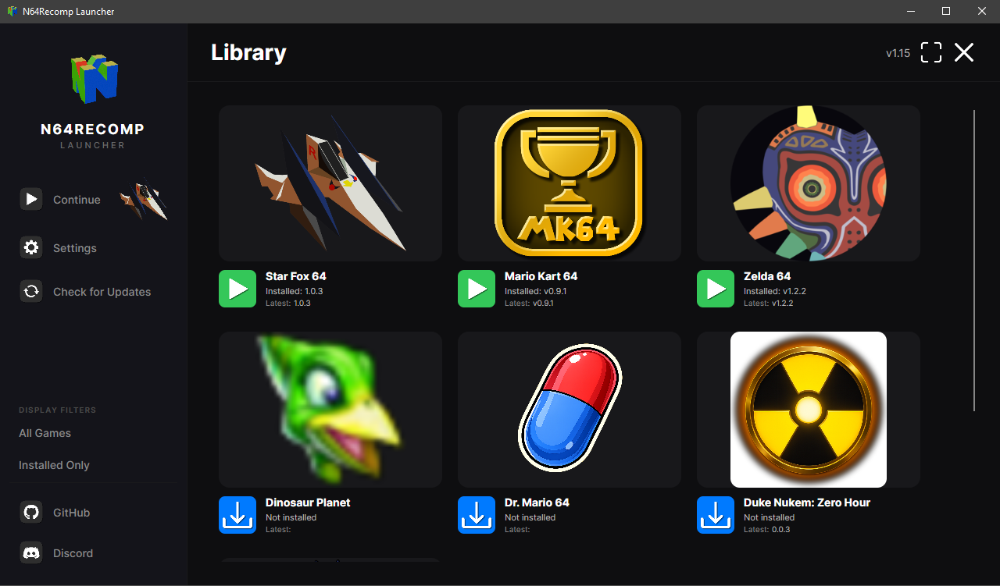

# N64Recomp Launcher

[](https://dotnet.microsoft.com/)
[](https://github.com/SirDiabo/N64RecompLauncher/blob/main/LICENSE)


A modern, user-friendly launcher application for managing and running N64 recompiled games. This tool streamlines the process of downloading, installing, and launching your favorite N64 titles.

> ⚠️ **Platform Compatibility Notice**
> - ✅ Windows: Works perfectly
> - ✅ Linux: Working mostly properly
> - ⚠️ macOS: Not yet supported
> - ⚠️ Linux Flatpak: Not yet supported

## ✨ Features

- **Automated Updates**: Seamlessly download and install the latest releases from GitHub
- **Version Management**: Stay up-to-date with automatic version checking and updates
- **Game Management**: Easy-to-use interface for launching your N64 games
- **Smart Integration**: Direct integration with GitHub releases for smooth updates

## 🚀 Getting Started

### Prerequisites

- .NET 9 Runtime (get it [here](https://dotnet.microsoft.com/en-us/))
- Internet connection for updates and downloads

### Installation

1. Download the latest release from the [Releases](https://github.com/SirDiabo/N64RecompLauncher/releases) page
2. Extract the downloaded archive to your preferred location
3. Run the executable.

## 🎯 Usage

1. Launch the application
2. The launcher will automatically check for updates on startup
3. Browse your game library through the intuitive interface
4. Select a game and click "Download/Launch" to play

## ⚙️ Configuration

### GitHub API Token
To avoid hitting GitHub's API rate limits, you can provide a personal access token.
Create a token with no special permissions needed and set it in the launcher settings.
You can create a token at ```GitHub Settings -> Developer settings > Personal access tokens > Tokens (classic) > Generate new token```
You don't need to give it any special permissions. Then paste that Token into your Settings field. Do not share your Token!

### games.json Structure

The launcher uses a `games.json` file to manage the available games. You can customize this file to add your own games or modify existing entries. The file is organized into three categories: `standard`, `experimental`, and `custom`.

#### Game Entry Properties

Each game entry requires the following properties:

- **`name`** - The display name of the game as it appears in the launcher
- **`repository`** - The GitHub repository in the format `username/repository`
- **`branch`** - The branch to fetch the game icon from (e.g., `main`, `dev`)
- **`imageRes`** - The filename of the icon PNG located in the repository's `/icons` directory (e.g., `512` for `512.png`)
- **`folderName`** - The folder name where the game will be downloaded and installed
- **`platformOverride`** - *(Optional)* Specifies a custom asset name if the release assets don't contain standard version numbers or platform identifiers. Leave as `null` if not needed
- **`customDefaultIconUrl`** *(Optional)* Overwrites the default Icon of each game. If left blank it will use the default recomp /blob/dev/icons/"imageRes".png, or be blank if not found. Leave as `null` if not needed

#### Example Configuration

```json
{
    "standard": [
        {
            "name": "Example Game",
            "repository": "username/example-game-repo",
            "branch": "main",
            "imageRes": "512",
            "folderName": "ExampleGame",
            "platformOverride": null,
            "customDefaultIconUrl": null,
        },
        {
            "name": "Another Game",
            "repository": "anotheruser/another-game-repo",
            "branch": "dev",
            "imageRes": "256",
            "folderName": "AnotherGame",
            "platformOverride": "custom-asset-name",
            "customDefaultIconUrl": "link/to/an/image.png",
        },
    ],
    "experimental": [
        {
            "name": "Experimental Game",
            "repository": "expuser/experimental-game-repo",
            "branch": "experimental",
            "imageRes": "128",
            "folderName": "ExperimentalGame",
            "platformOverride": "UniqueFileName",
            "customDefaultIconUrl": "link/to/a/different/image.jpg",
        },
    ],
    "custom": []
}
```

## 📞 Support

If you encounter any issues or have questions:
- [Open an issue](https://github.com/SirDiabo/N64RecompLauncher/issues)
- Check existing issues for solutions
- Join the [N64 Recomp Discord](https://discord.gg/DptggHetGZ)

---

<p align="center">Made with ❤️ for the N64 community</p>
